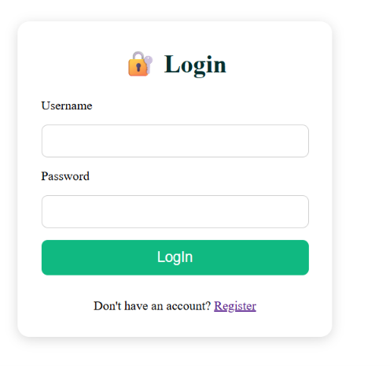
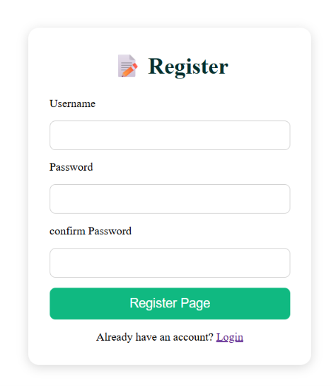
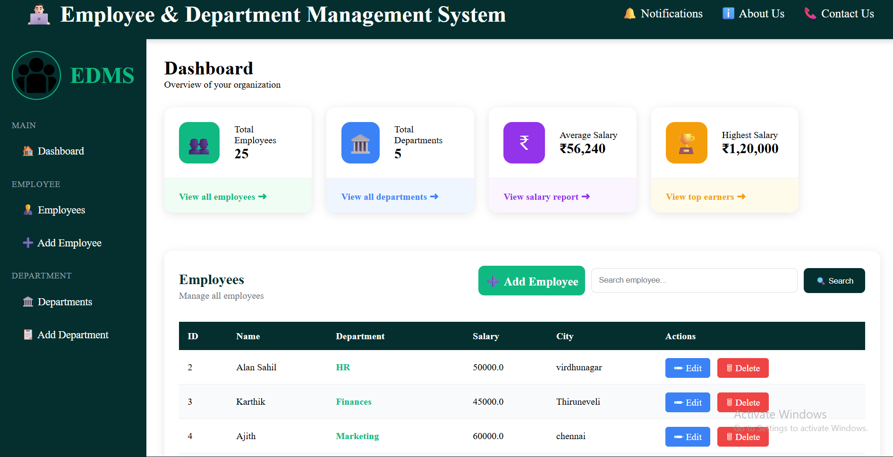
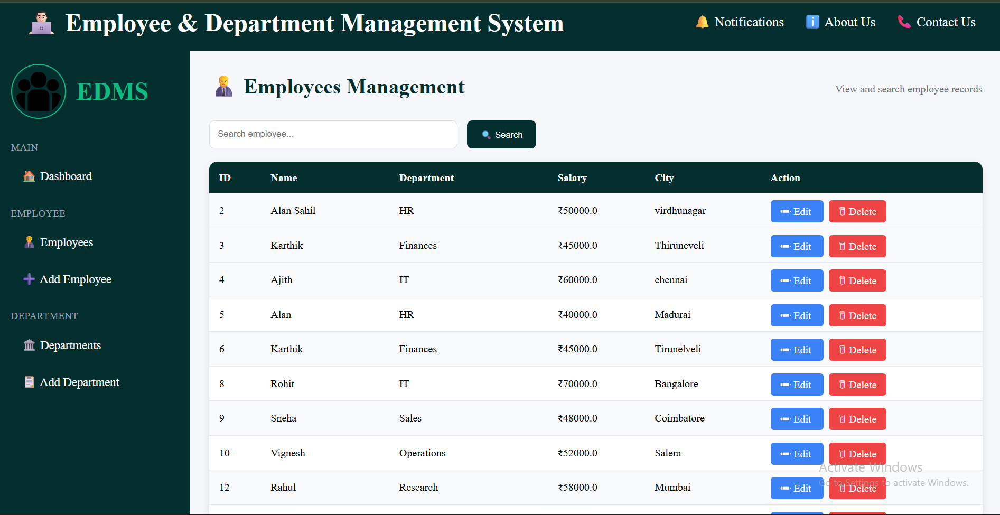
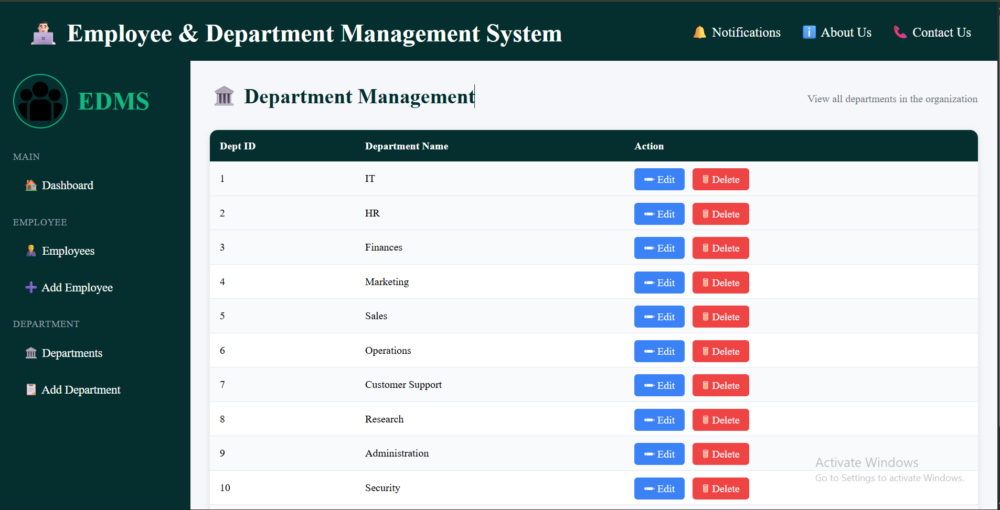
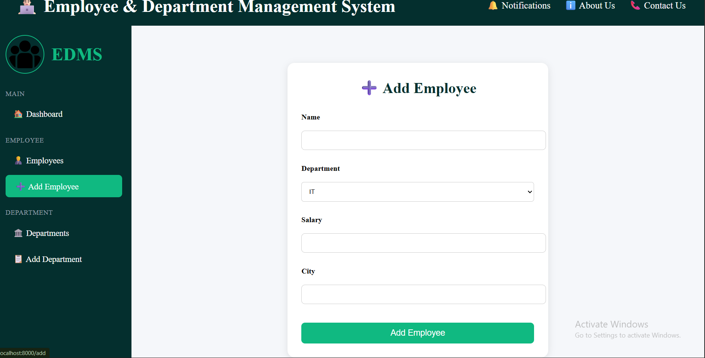
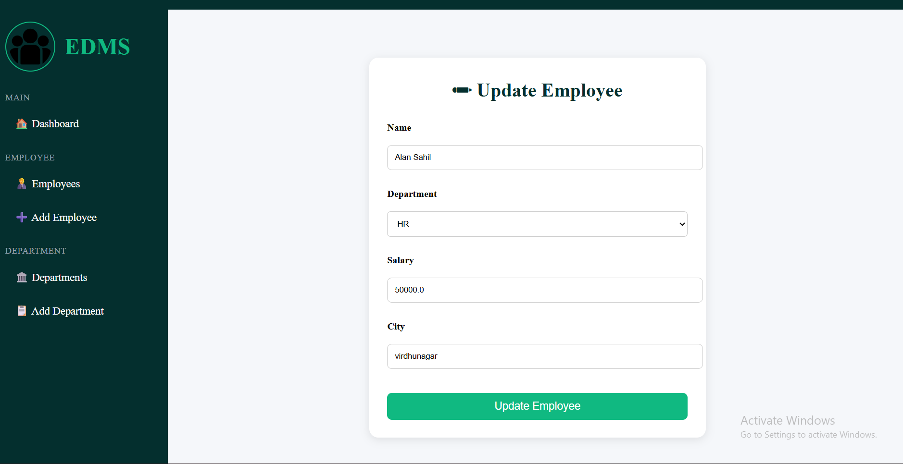
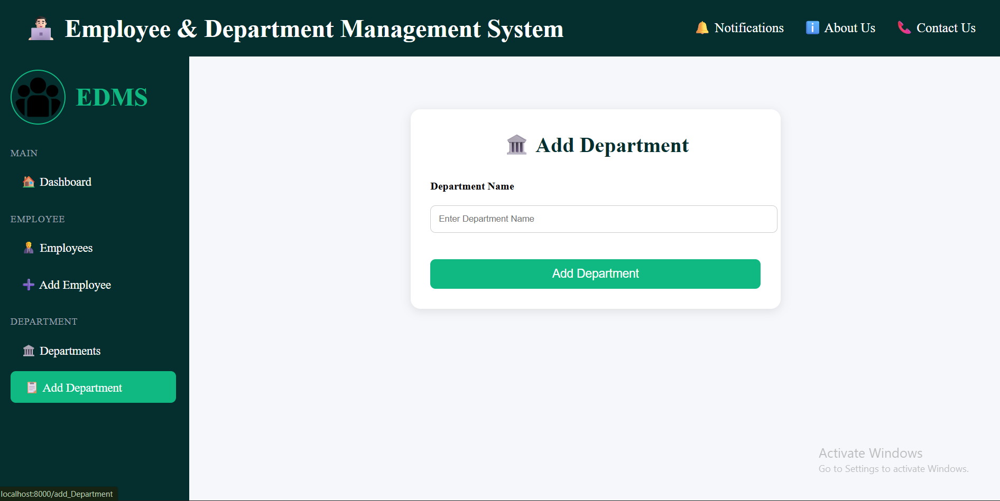
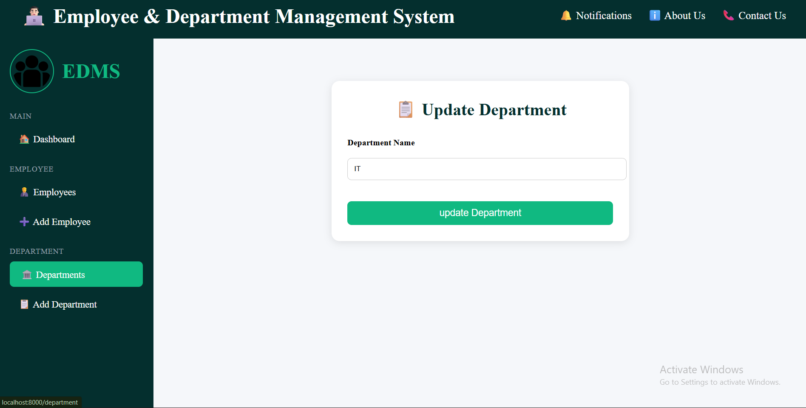
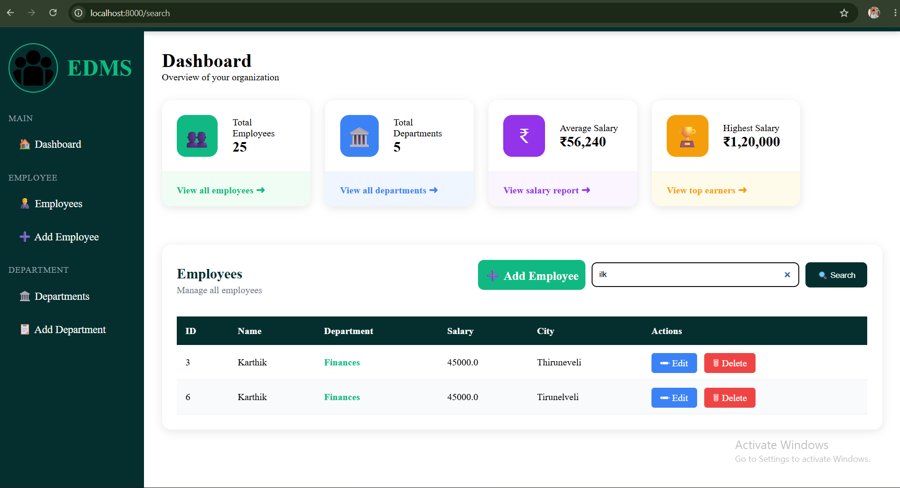

# 👨🏻‍💻 Employee & Department Management System

A web-based **Employee & Department Management System** developed using **Flask**, **MySQL**, **HTML**, **CSS**, and **Jinja2**. This application helps organizations manage employee records and department information through an intuitive dashboard with full CRUD functionality.

---

## 📌 Features

### 👨‍💼 Employee Management

* Add New Employee
* View All Employees
* Update Employee Details
* Delete Employee
* Search Employees by Name

### 🏛️ Department Management

* Add New Department
* View All Departments
* Update Department Details
* Delete Department
* Foreign Key Relationship Handling

### 📊 Dashboard

* Total Employees Count
* Total Departments Count
* Average Salary
* Highest Salary
* Quick Navigation Cards

### ⚙️ Additional Features

* Sidebar Navigation
* Responsive UI Design
* MySQL Database Integration
* Exception Handling
* Foreign Key Constraint Management
* User-Friendly Interface

---

## 🛠️ Technologies Used

| Technology | Purpose             |
| ---------- | ------------------- |
| Python     | Backend Programming |
| Flask      | Web Framework       |
| MySQL      | Database            |
| HTML5      | Structure           |
| CSS3       | Styling             |
| Jinja2     | Dynamic Templates   |

---

## 📂 Project Structure

```text
Employee-Department-Management-System/
│
├── static/
│   └── style.css
│
├── templates/
│   ├── home.html
│   ├── employees.html
│   ├── department.html
│   ├── add.html
│   ├── update.html
│   ├── add_department.html
│   └── update_dept.html
│
├── app.py
├── requirements.txt
└── README.md
```

---

## 🗄️ Database Structure

### Department Table

```sql
CREATE TABLE department(
    dept_id INT PRIMARY KEY AUTO_INCREMENT,
    dept_name VARCHAR(100) NOT NULL
);
```

### Employee Table

```sql
CREATE TABLE employee(
    id INT PRIMARY KEY AUTO_INCREMENT,
    name VARCHAR(100),
    salary DECIMAL(10,2),
    city VARCHAR(100),
    dept_id INT,
    FOREIGN KEY(dept_id)
    REFERENCES department(dept_id)
);
```

---

## 🔗 Relationship

```text
Department (Parent Table)
        │
        │ One-to-Many
        ▼
Employee (Child Table)
```

One department can contain multiple employees.

---

## 🚀 Installation

### 1. Clone Repository

```bash
git clone https://github.com/your-username/employee-department-management-system.git
```

### 2. Move Into Project Folder

```bash
cd employee-department-management-system
```

### 3. Install Dependencies

```bash
pip install flask mysql-connector-python
```

### 4. Configure MySQL

Update database credentials inside `app.py`:

```python
con = mysql.connector.connect(
    host="localhost",
    user="root",
    password="your_password",
    database="mangement"
)
```

### 5. Run Application

```bash
python app.py
```

### 6. Open Browser

```text
http://127.0.0.1:8000
```

---

## 📸 Screens Included
* login Page



*register Page

* Dashboard Page

* Employee Management Page

* Department Management Page

* Add Employee Form

* Update Employee Form

* Add Department Form

* Update Department Form

* search Function


---

## ⚠️ Exception Handling

The project handles database errors such as:

### Foreign Key Constraint Error

If a department contains employees, it cannot be deleted.

Instead of crashing, the application displays a user-friendly message:

```text
Department cannot be deleted because employees are assigned to it.
```

---

## 🎯 Learning Outcomes

This project demonstrates:

* Flask Routing
* CRUD Operations
* MySQL Database Connectivity
* SQL Joins
* Foreign Keys
* Jinja2 Templates
* Form Handling
* Exception Handling
* Frontend Design with HTML & CSS

---

## 👨‍💻 Author

**Ajith**

Python Backend Developer

---

## ⭐ Future Enhancements

* User Authentication
* Role-Based Access Control
* Pagination
* Salary Reports
* Department Wise Analytics
* Export Data to Excel/PDF
* REST API Integration

---

### 📜 License

This project is developed for educational and learning purposes.
